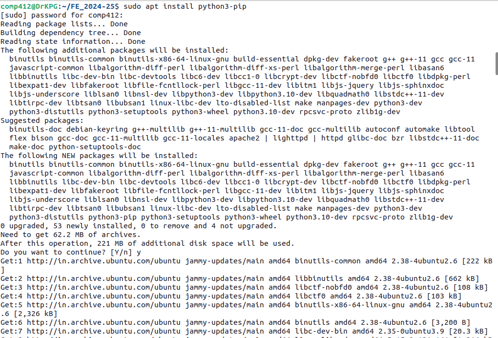
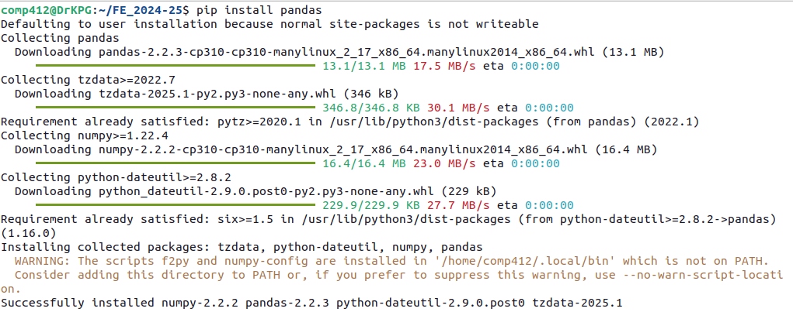
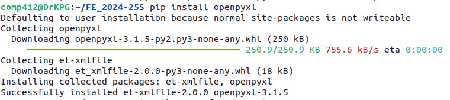

# Academic-Automation - Student Performance Categorization Based on Marks

**Challenge**: As Unit tests, Insemester Examinations are conducted in the institute. To identify the students who are weak in subjects, need to analyse the list of students and categorize the students into Outstanding, Good and Poor in subjects. This process is carried out in two different ways:
- Manually categroize the students based on Marks
- Using excel sheet, filter out the students.
In both approaches time required is nearly 20-30 minutes.

**Problem Statement**: *Develop an automation process which will reduce human efforts required to categorize the students based on marks and minimize the time required.*

This project contains various development versions like simple **python automation script**, **python automation script with GUI**, **containerized application** as well as **web application** to assess the performance of students based on Marks obtained in the subject.

## Approach 1. Using simple Python AUtomation Script.
###Steps ar as follows:
1. Required: Operating System-Ubuntu 22.04, Programming Platform: Python 3.10
2. Install the pip
   - **sudo apt install python3-pip**
     
3. Install pandas python library
   - **pip install pandas -y**
     
4. Install openpyxl python library
   - **pip install openpyxl -y**
   -  
     
5. Download the Automation script (performancecategory.py) present in **version1.0** directory.
6. Execute the command on Ubuntu Terminal : **python3 performancecategory.py**
7. **categroized_students.xlsx** file generated with classification.
  
## Approach 2. Using Python Based GUI Application. 
###Steps are as follows:
**NOTE**: steps 1-4 are same as that of Approach 1.
5. Install tkinter library
   - **sudo apt install python3-tk**   
6. Download the Automation script (performancecategoryGUI.py) present in **version1.1** directory.
7. Execute the command on Ubuntu Terminal : **python3 performancecategoryGUI.py**
8. **categroized_students.xlsx** file generated with classification.

## Approach 3. Containerized Python Based GUI Application.
###Steps are as follows:
**NOTE**: steps 1-5 are same as that of Approach 2
6. Develop Dockerfile (version1.2/Dockerfile) to convert python application into dockerized application.
7. Build the docker image of application using following command-
   $ docker build -t student-classification-app .
8. Execute the command on Terminal : xhost +local:root
9. Run the Docker Container
   $docker run --rm -e DISPLAY=$DISPLAY -v /tmp/.X11-unix:/tmp/.X11-unix -v /home:/app/data student-categorizer-app

## Approach 4. Web Application.
###Steps are as follows:
1. Development of Flask-based Web App
2. Development simple frontend
   

  
## Achievement
- Before this automation, time required to generate the xls sheet with the claissifcation Outstanding, Good and Poor was 20-30 mintues, but with this automation time required to generate classified xls sheet is ~ 5-7 Seconds.

      
 
